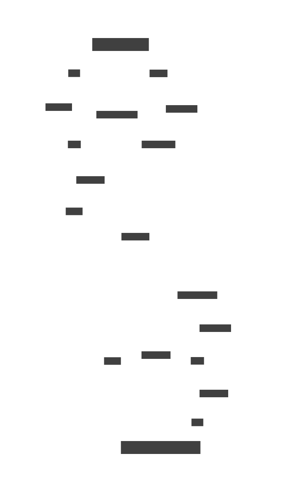

# OIF: Intent based cross-chain swaps

OIF is an intent based cross-chain swap protocol. Users sign intents: What asset they want, how they want etc, etc. which is claimed and then delivered by solvers.

It is intended to be used in a Output first, inputs second context in conjunction with resource locks. This increases the integration flexibility and provides a better user experience.

The OIF is built to be trust minimized and modular. It consists of 
- **Lock Mechanism**: The system is designed to keep the lock mechanism outside of the core design. As a result, it can easily support new locks.
- **Settler**: Main contract that sits on the origin chain. Serves multiple roles but the main role is to facilitate the translation of proofs to the unlock call for the lock.
- **Filler**: Main contract on the remote chain. Allows solvers to fill outputs of orders.
- **Oracle**: Proof layer. Generally a messaging protocol but can be anything: Optimistic proofs, light clients, storage proofs, off-chain agent, etc. 

Every component is intended to be replaceable as a component. As a result, there are minimal dependencies between the various components:
- The Settler defines the order structure and is (by default) not used anywhere else.
- The Filler and Settler defines a common output fill payload. The oracle doesn't understand the payload.
- Only the Settler is aware of the lock's unlock mechanism.

This framework allows anyone to easily add or remove logic according to the user's demand.


Refer to the SVG diagram chart.

### Dictionary 

- Lock: An external contract that facilitates lock of the input assets for the sponsor.
- Origin Chain: The chain where the Settler and Sponsor are.
- Destination Chain: The chain where the Filler.
- User: The end user of the protocol.
- Solver: An external entity that facilitates swaps for users.
- Sponsor: The provider of the assets on the origin chain. Will get their asssets (output) first, and pay (inputs) second.
- Fill (Actor): The provider of assets on the destination chain and executors of swaps. Will pay (outputs) first, and get their assets (inputs) second.
- Input: Assets provided by the sponsor for the outputs of an order. Will be held by the designated lock.
- Outputs: Asset of an order desired by the sponsor.

## Settler

Settlers are located in `src/settlers`. Currently 2 Settlers are implemented:
- `src/settlers/compact/CompactSettler.sol`
- `src/settlers/compact/CompactSettlerWithDeposit.sol`

To implement a new lock or a different order type, the following considerations are required to make it compatible with the rest of the system:
1. Implement outputs that match the `MandateOutput` described in `src/libs/MandateOutputEncodingLib.sol` to make it compatible with existing fillers.
2. Implement a function similarly to `_validateFills` of `src/settlers/compact/CompactSettler.sol` to make it compatible with the existing oracles.

Assuming the Settler supports these structures, it is now compatible with the existing solvers and fillers.

### Selection of solver

If an Order contains multiple outputs, the _true_ solver will be the one filling the first output. That means:
- If multiple solvers fill different outputs, only the first solver gets to decide who gets paid.
- A solver may fill the first output but now the remaining. This effictivly voids the order. Always make the most first output the most expensive.
- Output 1 will be solved first while the remaining outputs may first be filled later.
- Dutch auctions only works on the first output.
- The OIF does not support composing multiple assets into a single output call; You cannot know which order the outputs will be filled in.

The cheap flow for order resolution requires every solver to be provided identically. Alternative resuce functions are available to resolve mistakes or if a malicious actor filled one or more outputs.

###  Order Purchasing / Underwriting

The OIF supports underwriting. Within the contracts, this is described as order purchasing. Underwriting serves 2 purposes:
1. To speed up solver capital rotation by borrowing assets from less risk adverse solvers.
2. In case of the user acting as the solver, the 

When implementing a new Settler, you may inherit `src/settlers/BaseSettler.sol` to core features to facilitate order purchasing.

### Inputs vs Outputs

Orders have 2 lists of tokens – Inputs and Outputs – to describe which assets (inputs) the sponsor is offering and which assets the filler should provide in exchange (outputs).
The Settler always sits on the origin chain together with the input tokens.
In a normally operating implementation, the user is the sponsor providing the inputs and the solver is the filler providing the outputs.

If a chain does not have a Settler, it is not possible to initiate orders on the chain or let the chain's assets be inputs. Oracles may still support verifying assets on the chain, as such they can be set as outputs.

### Supporting any chain through User as filler. 

Using underwriting, it is possible for The OIF to operate in reverse mode, where the user is the filler and the solver is the sponsor. Assume that chain A is supported by the messaging protocol while chain B is not.
By implementing the validation logic on chain B, a message can be emitted from chain A that can be verified on chain A. Proofs are sent from the destination chain to the origin chain. As a result, a Settler can function on chain B but not on chain A to facilitate a swap from chain B to chain A; Ordinarily the user can only swap from B to A.

However, by operating in reverse mode, the User becomes the filler and the Solver becomes the sponsor. That means the user provides the assets on chain A while getting assets on chain B; A swap from chain A to chain B.

This scheme allows The OIF to scale to any chain where only one of the chains have a working messaging protocol – This includes chains like Bitcoins where settlement proofs can be sent from Bitcoin to other chains but not the other way around.

#### ChainIds

ChainIds should typically follow the "canonical" chain id: `block.chainid`. While the remote chainId is defined by the localOracle, it is good practise to implement it as the remote chain's `block.chainid` or equivalent.

## Filler (contract)

The filler contract sits on the destination chain and allows filling outputs. It is expected that fillers can verify if a payload is appropriately described via the `.arePayloadsValid()` view function. Notice that the requirement that the filler asserts payloads means that the Filler and Settler needs to form the same payloads to properly validate that outputs have been filled.

Otherwise, the fill interface is left undefined. It is generally expected that the filler takes outputs as `MandateOutput`.

## Oracle

Oracles are located in `src/oracles`. `src/oracles/BaseOracle.sol` provides a standardized attestation storage structure along with attestation lookup structures. This allows anyone to easily create new oracles that remains compatible with Settlers.

Message submission and/or relaying is not defined and has to be created specifically for each oracle. The most important compatibility layer between fillers and oracles exists through the `IPayloadCreator.arePayloadsValid`.

### Bitcoin SPV (Light) Client

To validate Bitcoin transactions This repository depends on the SPV client Bitcoin Prism. This repository does not contain it but depends on it as a submodule under `lib/bitcoinprism-evm`.

Unlike other oracles, it is required that Bitcoin oracles filled optimistically. This is because it is not possible to provide the solver identifier cheaply on Bitcoin.

## Usage

### Build

```shell
forge build [--sizes]
```

### Test

```shell
forge test [--fuzz-runs 10000] [--gas-report --fuzz-seed 10]
```

#### Gas report
```shell
forge test --gas-report
```

### Coverage

```shell
forge coverage --no-match-coverage "(script|test|wormhole/external/wormhole|wormhole/external/callworm/GettersGetter)" [--report lcov]
```